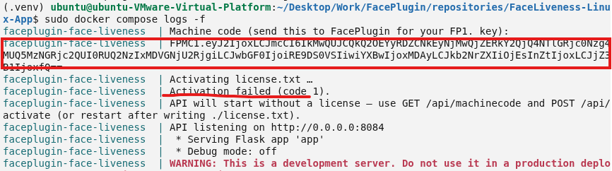
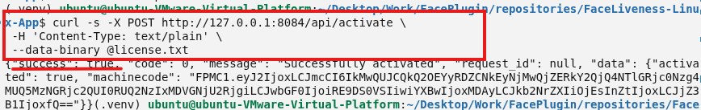

<div align="center">

</div>

#### 🌐 Company Site - [Here](https://faceplugin.com)
#### 🤗 Hugging Face - [Here](https://huggingface.co/FacePlugin-Ltd)
#### 🛟 Help Center - [Here](https://doc.faceplugin.com)
#### 🐳 Docker Hub - [Here](https://hub.docker.com/r/faceplugin/face-liveness)

# FacePlugin Face Liveness SDK — Linux / Docker (Fully On-Premise)

> **Ready in minutes:** `docker pull` → copy `FPMC1.…` from logs → `curl /api/health`.  
> Jump: [Quick Start](#quick-start) · [Start the API](#start-the-api) · [SDK License](#sdk-license) · [Setup on your own app](#setup-on-your-own-app) · [Try it](#try-it)

## Quick Start

- [ ] Download and run the appropriate Docker image from [FacePlugin Docker Hub](https://hub.docker.com/r/faceplugin/face-liveness). [See Option A for details](#option-a--docker-hub-no-drive-download).
- [ ] **Confirm it is running:** `curl -s http://127.0.0.1:8084/api/health` (no license needed yet)
- [ ] [Contact us](#contact) with your machine code (`FPMC1.…`) to obtain a license key, then activate with `POST /api/activate` — [SDK License](#sdk-license)
- [ ] **Try it:** Postman, curl, or local Gradio demo on **9004** (`demo.py`)

Docs: [https://doc.faceplugin.com](https://doc.faceplugin.com)

## Introduction

FacePlugin **Face Liveness SDK for Linux / Docker** is a fully on-premise anti-spoofing engine for KYC and remote identity verification. It scores a single RGB face image for presentation attacks — printed photos, screens, printouts, and video replay — and returns Real / Spoof with a pass score.

This repository is **standalone**. Pull Docker Hub (no Drive) or download the runtime into this repo and run — **no other FacePlugin repository is required**.

All processing stays on your server. **No** biometric data is sent to FacePlugin cloud — built for banking, eKYC, and on-premise compliance workflows.

**One repository** for Linux SDK + Docker. Native libraries are **linux/amd64**. The Docker image runs on Linux, Windows, and macOS hosts (Apple Silicon uses amd64 emulation). This product is **CPU-only**.

Test with curl, Postman, or the local Gradio demo (`demo.py`). Docs: [https://doc.faceplugin.com](https://doc.faceplugin.com).

### Main Functionalities

| Feature | API |
| ------- | --- |
| RGB face liveness (all engines combined) | `POST /api/liveness` · `sdk.liveness` |
| Photo, screen, print, and replay presentation-attack detection | same call |
| Score, Real/Spoof, pass | `data.score` · `data.result` · `data.pass` |
| Health / machine code / activate | `GET /api/health` · `GET /api/machinecode` · `POST /api/activate` |

Score **≥ 0.5** → `result: "Real"`, `pass: true`. Score **< 0.5** → `result: "Spoof"`, `pass: false`.

`POST /api/check_liveness` is an alias of `/api/liveness`.

### Product List

| Platform | Repository |
|----------|------------|
| Android (Recognition) | [FaceRecognition-Android](https://github.com/Faceplugin-ltd/FaceRecognition-Android) |
| iOS (Recognition) | [FaceRecognition-iOS](https://github.com/Faceplugin-ltd/FaceRecognition-iOS) |
| React Native (Recognition) | [FaceRecognition-React-Native](https://github.com/Faceplugin-ltd/FaceRecognition-React-Native) |
| Flutter (Recognition) | [FaceRecognition-Flutter](https://github.com/Faceplugin-ltd/FaceRecognition-Flutter) |
| Ionic Capacitor (Recognition) | [FaceRecognition-Ionic-Capacitor](https://github.com/Faceplugin-ltd/FaceRecognition-Ionic-Capacitor) |
| Ionic Cordova (Recognition) | [FaceRecognition-Ionic-Cordova](https://github.com/Faceplugin-ltd/FaceRecognition-Ionic-Cordova) |
| Windows (Recognition) | [FaceRecognition-Windows](https://github.com/Faceplugin-ltd/FaceRecognition-Windows) |
| Linux / Docker (Recognition) | [FaceRecognition-Docker](https://github.com/Faceplugin-ltd/FaceRecognition-Docker) |
| Android (Liveness) | [FaceLivenessDetection-Android](https://github.com/Faceplugin-ltd/FaceLivenessDetection-Android) |
| iOS (Liveness) | [FaceLivenessDetection-iOS](https://github.com/Faceplugin-ltd/FaceLivenessDetection-iOS) |
| Windows (Liveness) | [FaceLivenessDetection-Windows](https://github.com/Faceplugin-ltd/FaceLivenessDetection-Windows) |
| **Linux / Docker (Liveness)** | **[FaceLivenessDetection-Docker](https://github.com/Faceplugin-ltd/FaceLivenessDetection-Docker)** (**this repo**) |


## Before you start

| Step | What you need |
| ---- | ------------- |
| 1 | A Linux host **or** Docker |
| 2 | Docker Hub pull does not require Google Drive. Populate `./lib/cpu/` only for Compose or `./run.sh` — see [Get the runtime](#get-the-runtime-options-b-and-c) |
| 3 | Start **without** a license. Copy `FPMC1.…` from logs or `GET /api/machinecode`, send it to FacePlugin ([contact](#contact)), then activate with your license key |

### System requirements

| Item | Minimum | Recommended |
| ---- | ------- | ----------- |
| CPU | 2 cores | 8 cores |
| RAM | 4 GB | 8 GB |
| Disk | 4 GB | 8 GB |
| OS (Docker) | Linux + Docker Engine | Ubuntu 22.04 / 24.04 |
| OS (local `./run.sh`) | Ubuntu 20.04+ (x86_64), Python 3.10+ | Ubuntu 22.04 / 24.04 |

## Start the API

You can start **without** a license — the server prints your machine code on startup.

The API starts even if activation fails. Copy the **machine code** (`FPMC1.…`) from the log and send it to FacePlugin.

<p align="center">
 
</p>

### Option A — Docker Hub (no Drive download)

```bash
sudo docker pull faceplugin/face-liveness:latest
sudo docker run -d --name faceplugin-face-liveness \
  --shm-size=1gb --privileged \
  -p 8084:8084 \
  -v /etc/machine-id:/etc/machine-id:ro \
  faceplugin/face-liveness:latest
sudo docker logs -f faceplugin-face-liveness
# Look for the machine code line: FPMC1.…
```

### Several containers, one license

On **Linux**, add `-v /etc/machine-id:/etc/machine-id:ro` to the `docker run` above so the machine code stays on that host. Then start another container with a **new name and host port** — same image, same license key:

```bash
sudo docker run -d --name faceplugin-face-liveness-2 \
  -p 8085:8084 \
  -v /etc/machine-id:/etc/machine-id:ro \
  faceplugin/face-liveness:latest
```

Activate on each host port with the same key. On **Docker Desktop** (macOS/Windows) skip the `machine-id` volume; each container may need its own license.

### Get the runtime (Options B and C)

**Skip this if you used Docker Hub** (`docker pull` / `docker run`). Runtime is already inside the image.

`./lib/cpu/` is empty on GitHub because binaries are too large. Face Liveness Linux is **CPU-only** — there is no `gpu/` package.

**[FaceLiveness-Linux runtime (Google Drive)](https://drive.google.com/drive/folders/1rFnw7VASLmA4q8NWenQgszFS8njRGEgt)**

1. Clone the repo:

```bash
git clone https://github.com/Faceplugin-ltd/FaceLivenessDetection-Docker.git
cd FaceLivenessDetection-Docker
```

2. Download **all files** from the Drive folder.
3. Put every file **directly** into `./lib/cpu/` — not inside a nested subfolder.

```text
FaceLivenessDetection-Docker/
└── lib/
    └── cpu/
        ├── libFaceLivenessSDK.so
        ├── libfal-eng.so
        ├── fal.fpk
        └── …
```

```bash
ls lib/cpu/libFaceLivenessSDK.so
ls lib/cpu/fal.fpk
```

If those paths exist, you are ready for Option B or C.

### Option B — Docker Compose

Requires [./lib/cpu/ filled from Drive](#get-the-runtime-options-b-and-c).

```bash
cd FaceLivenessDetection-Docker
# macOS/Windows Docker Desktop: remove the /etc/machine-id volume from docker-compose.yml first
sudo docker compose up --build -d
sudo docker compose logs -f
```

Detached Compose has no TTY — activate with curl (below).

### Option C — Native Linux (no Docker)

Requires [./lib/cpu/ filled from Drive](#get-the-runtime-options-b-and-c).

```bash
cd FaceLivenessDetection-Docker
pip3 install -r requirements.txt
./run.sh
```

API: **[http://127.0.0.1:8084](http://127.0.0.1:8084)**

## SDK License

Licenses are **offline** and **bound to a machine code**. Offline cryptography is built into the SDK — no OpenSSL install.

1. Start the server (above). A license is not required for the first start.
2. Copy the machine code from the log (`FPMC1.…`).
3. Send that code to FacePlugin ([contact](#contact)). We issue a license key for that code.
4. Activate with the license key:

```bash
# Paste your license key into ./license.txt, then:
curl -s -X POST http://127.0.0.1:8084/api/activate \
 -H 'Content-Type: text/plain' \
 --data-binary @license.txt
```

<p align="center">
 
</p>

Or stop the process, save `license.txt`, and run `./run.sh` / `docker compose restart` again.

**Docker and local host codes are different.** Use the machine code from the environment you will run in production.

## Try it

### Health

```bash
curl -s http://127.0.0.1:8084/api/health
```

### Liveness

```bash
curl -s -X POST http://127.0.0.1:8084/api/liveness \
 -H 'Content-Type: application/json' \
 -d '{"image":"<base64-jpeg>"}'
```

Success `data`:

```json
{ "score": 0.72, "result": "Real", "pass": true }
```

Docs: [https://doc.faceplugin.com](https://doc.faceplugin.com)

### Postman

Import [`postman/FaceLiveness-API.postman_collection.json`](postman/FaceLiveness-API.postman_collection.json). Base URL: `http://127.0.0.1:8084`

### Demo UI (Gradio) — local only

The Docker image is API-only (no Gradio). For a local FacePlugin Face Liveness demo in the browser — Real / Spoof score and Pass — with the API already running on port 8084:

```bash
pip3 install -r requirements-demo.txt
DEMO_PORT=9004 API_BASE=http://127.0.0.1:8084 python3 demo.py
```

Open **[http://127.0.0.1:9004](http://127.0.0.1:9004)**. Samples: `assets/examples/samples/`.

<p align="center">
 
</p>

Each run shows **Score**, **Result** (`Real` or `Spoof`), and **Pass** for presentation-attack detection.

## Setup on your own app

Two ways to call the same engine. Full protocol: [https://doc.faceplugin.com](https://doc.faceplugin.com).

| Path | When to use |
| ---- | ----------- |
| **HTTP** (`app.py`) | Any language. Keep this API running and `POST` a base64 JPEG. |
| **`sdk.py`** | Python on the **same** Linux host as `lib/cpu/` (or inside the container). No HTTP hop. |

**HTTP (any language):** start the API, then `POST /api/liveness` with `{"image":"<base64-jpeg>"}`. See [Try it](#try-it) and Postman.

**Python in-process:** copy `sdk.py` + `lib/cpu/` into your project (or `import sdk` from this repo). Call order: `get_machine_code` → `activate` → `init_sdk` → `liveness`. Return code `0` means success.

You do **not** need Gradio (`demo.py`) in production — it is a host-only test UI.

## About SDK

Python bindings: [`sdk.py`](sdk.py). Return code `0` means success.

```python
import sdk

machine_code = sdk.get_machine_code() # FPMC1.…
sdk.activate("license.txt")
sdk.init_sdk()
result = sdk.liveness(base64_image)
```

`result` is JSON. `data` is `{ "score": <float>, "result": "Real" | "Spoof", "pass": <bool> }`. All RGB engines are always run and combined.

## Contact

<div align="left">
<a target="_blank" href="mailto:info@faceplugin.com"></a>&emsp;
<a target="_blank" href="https://wa.me/+14692784822"></a>
</div>
